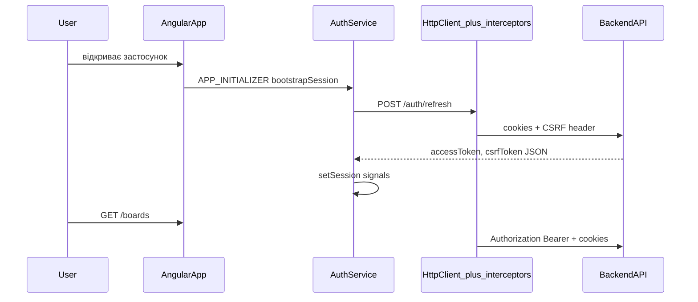

# Авторизація на фронтенді (Kanban SPA) — посібник для початківців

Цей документ пояснює **як саме** у цьому проєкті працює вхід, збереження сесії та захищені запити. Якщо ти щойно дивишся на Angular і HTTP — почни з розділу «Базові ідеї», потім йди по сценаріях зверху вниз.

Загальний контракт з API (CORS, cookie, ендпоінти) дублюється й розширюється в [frontend.md](./frontend.md).

---

## Базові ідеї (без зайвого жаргону)

### Навіщо взагалі «токени»

Сервер не може «пам’ятати», що ти вже ввів пароль на кожен клік. Тому після успішного логіну він видає **доказ**, що ти — ти:

1. **Access token (JWT)** — короткоживучий «квиток». Його ми кладемо в **пам’ять** додатку (Angular **signals** у `AuthService`). Його треба надсилати в заголовку `Authorization: Bearer ...` на захищені запити (`GET /boards`, `PATCH /cards/...` тощо).

2. **Refresh token** — довгоживучіший «квиток оновлення». Його сервер кладе в **cookie з прапорцем HttpOnly**. Це означає: **JavaScript не може прочитати цей cookie з коду** (на відміну від access, який ми самі тримаємо в змінних). Браузер **сам** додає цей cookie до запитів на API, якщо запит зроблено з **`withCredentials: true`**.

Тобто: **access** ми явно читаємо і підставляємо в заголовок; **refresh** живе в cookie і їде «під капотом».

### Навіщо ще CSRF і два cookie

Якщо зловмисний сайт спробує з твоєї вкладки відправити запит на **наш** API, браузер **може** прикріпити cookie (залежить від SameSite і типу запиту). Щоб такий «підроблений» запит не міг, наприклад, **розлогінити** тебе або **оновити сесію**, сервер вимагає **додатковий секрет у заголовку** — той самий рядок, що й у **другому, читабельному** cookie (double-submit). Ти маєш надіслати **`X-CSRF-Token`** або **`X-XSRF-TOKEN`** з тим самим значенням, що й cookie **`XSRF-TOKEN`** (ім’я можна змінити на бекенді; на фронті воно в `environment.csrfCookieName`).

Читабельний CSRF-cookie має бути видимий у **`document.cookie`** на будь-якій сторінці SPA (зазвичай **`Path=/`** на бекенді), інакше після оновлення сторінки на `/boards` JS не зможе прочитати значення для заголовка.

### Що таке `withCredentials: true`

Це налаштування HTTP-клієнта: **надсилати cookie** на інший origin (коли фронт на `localhost:4200`, а API на `3500`) або взагалі передавати cookie там, де потрібно. У проєкті **кожен** вихідний запит проходить через інтерцептор, який виставляє `withCredentials: true` (див. нижче).

На бекенді origin фронту має бути в **`CORS_ORIGINS`**, і CORS має дозволяти **credentials**.

---

## Де в коді що лежить (карта файлів)

| Що робить | Файл |
|-----------|------|
| Пам’ять: access + csrf, silent refresh при старті | `src/app/core/auth/auth.service.ts` |
| Виклики `/auth/*` і `/users/me` | `src/app/data/auth-api.service.ts` |
| Порядок старту додатку, HTTP, XSRF, bootstrap | `src/app/app.config.ts` |
| Заголовок CSRF для refresh/logout | `src/app/core/interceptors/csrf-cookie.interceptor.ts` |
| Bearer + refresh при 401 | `src/app/core/interceptors/auth.interceptor.ts` |
| Тости, редірект на логін при 401 з API | `src/app/core/interceptors/http-error.interceptor.ts` |
| Захист маршрутів «тільки для залогінених» | `src/app/core/guards/auth.guard.ts` |
| Захист `/login` і `/register`: не пускати залогіненого | `src/app/core/guards/anonymous.guard.ts` |
| Форма входу | `src/app/features/auth/login.component.ts` |
| Шапка, logout, підвантаження профілю | `src/app/features/shell/shell.component.ts` |

---

## Як виглядає потік даних (спрощена схема)

---

## Сценарій 1: користувач натискає «Увійти»

1. **`LoginComponent`** викликає `AuthApiService.login({ email, password })`.
2. **`HttpClient`** відправляє `POST /auth/login` з `withCredentials: true`.
3. Інтерцептори:
   - **`csrfCookieInterceptor`** — для `/auth/login` нічого особливого не робить (не refresh/logout).
   - **`authInterceptor`** — для URL з `/auth/login` **не** додає `Authorization` (це не захищений «звичайний» ресурс).
4. Відповідь JSON містить **`accessToken`**, **`csrfToken`**, **`user`**.
5. Браузер зберігає **HttpOnly refresh** і **читабельний CSRF-cookie** (виставляє сервер через `Set-Cookie`).
6. Компонент викликає **`auth.setSession({ accessToken, csrfToken })`** — значення потрапляють у **signals**.
7. Профіль кладуть у **`BoardStore`**, роутер веде на **`/boards`**.

Після цього **access** і **csrf** у пам’яті; **refresh** і CSRF-cookie — у браузері.

---

## Сценарій 2: користувач уже залогінений і відкриває список дошок

1. Компонент або сервіс викликає щось на кшталт `GET /boards` через `BoardApiService`.
2. Запит іде в **`HttpClient`**.
3. **Порядок інтерцепторів** (важливо!) у `app.config.ts`:

   `csrfCookieInterceptor` → `authInterceptor` → `httpErrorInterceptor`

4. **`authInterceptor`**:
   - додає **`Authorization: Bearer <accessToken>`**, якщо URL **не** є чисто auth-ендпоінтом логіну/реєстрації/refresh/logout;
   - завжди клонує запит із **`withCredentials: true`**, щоб пішли cookie.
5. Якщо сервер відповідає **200** — ти бачиш дані.

---

## Сценарій 3: access протермінувався (401), але refresh ще валідний

1. Запит на наприклад `GET /boards` повертає **401**.
2. **`authInterceptor`** ловить помилку:
   - якщо це не логін/реєстрація, не сам `refresh`, і запит ще **не** позначений як «вже повторений після refresh» — він викликає **`authApi.refresh()`** (один спільний запит на всі паралельні 401 завдяки `shareReplay`).
3. **`csrfCookieInterceptor`** для `POST /auth/refresh` додає **`X-CSRF-Token`**, якщо ще немає заголовка: спочатку читає **cookie** з `document.cookie`, якщо порожньо — бере **`csrfToken` з `AuthService`** (пам’ять).
4. Після успішного refresh **`auth.updateTokens(...)`**, потім **той самий** оригінальний запит **повторюють** уже з новим Bearer.
5. Якщо refresh **не вдався** — сесія очищується, редірект на **`/login`**.

**Примітка:** **`httpErrorInterceptor`** також обробляє 401: для **`/auth/refresh`** і **`/auth/logout`** він **не** робить глобального скидання сесії через редірект (щоб не заважати цим викликам). Для інших URL при 401 він очищає локальну сесію й веде на **`/login`**. Порядок інтерцепторів у `app.config.ts`: `csrfCookieInterceptor` → **`authInterceptor`** → **`httpErrorInterceptor`**. Якщо під час дебагу побачиш дивну поведінку саме на 401, перевір у мережевій вкладці, чи встигає відпрацювати refresh із `authInterceptor`.

---

## Сценарій 4: користувач натиснув F5 на `/boards`

1. Пам’ять JavaScript **очищується** — signals з access/csrf стають порожніми.
2. Під час старту Angular виконує **`APP_INITIALIZER`**: викликається **`AuthService.bootstrapSession()`**.
3. Якщо **access** ще немає, сервіс робить **`POST /auth/refresh`** (знову через інтерцептори → CSRF header з **cookie**, бо cookie з `Path=/` видно на `/boards`).
4. Якщо refresh cookie ще валідний — у відповіді знову приходять **access** і **csrf** → **`setSession`**.
5. Далі **`authGuard`** на захищених маршрутах теж викликає **`await bootstrapSession()`** (ідемпотентно: другий раз той самий внутрішній `Promise`), потім перевіряє **`hasSession()`** (є access чи ні).
6. Якщо refresh не вдався — guard відправляє на **`/login`**.

Так відновлюється сесія **без** збереження access у `localStorage` / `sessionStorage`.

---

## Сценарій 5: екран логіну, але в cookie ще жива сесія

**`anonymousGuard`** на `/login` і `/register` теж викликає **`bootstrapSession()`**. Якщо silent refresh вдався — **`hasSession()`** true → редірект на **`/boards`**, щоб не показувати форму входу зайвий раз.

---

## Сценарій 6: вихід (logout)

1. **`ShellComponent`** викликає **`authApi.logout()`** — `POST /auth/logout` з credentials і CSRF-заголовком (через ті ж інтерцептори).
2. Навіть якщо запит впав з мережевої причини, у **`finally`** викликають **`auth.clearSession()`**, чистять store і ведуть на **`/login`**.

---

## Де зберігається що (коротко)

| Дані | Де живуть | Після F5 |
|------|-----------|----------|
| Access JWT | Пам’ять (`AuthService` signal) | Зникає; відновлюється через refresh |
| csrfToken з JSON | Пам’ять (`AuthService` signal) | Зникає; оновлюється з відповіді refresh або читається cookie для заголовка |
| Refresh | HttpOnly cookie | Лишається в браузері (поки не прострочиться / logout) |
| CSRF (читабельний) | Cookie `XSRF-TOKEN` (або ім’я з env) | Лишається; має бути `Path=/` для зручності SPA |

---

## Angular XSRF (`withXsrfConfiguration`)

У **`app.config.ts`** увімкнено **`withXsrfConfiguration`**: Angular за певних умов сам додає заголовок **`X-XSRF-TOKEN`** з cookie з іменем **`environment.csrfCookieName`**. Паралельно **`csrfCookieInterceptor`** гарантує **`X-CSRF-Token`** для **`POST /auth/refresh`** і **`POST /auth/logout`**, якщо заголовок ще не стоїть. Бекенд приймає **будь-який** з цих варіантів (див. API-доки).

---

## Що перевірити, якщо «не логінить» або «після F5 вилітає»

1. **CORS + credentials:** фронт у `CORS_ORIGINS`, запити з `withCredentials`.
2. **CSRF-cookie** видно в DevTools → Application → Cookies; **`Path=/`** для читабельного CSRF.
3. **Ім’я cookie** на бекенді = **`environment.csrfCookieName`** на фронті.
4. У **dev** з `ng serve` часто `apiUrl: ''` і **proxy** — тоді cookie виглядають як same-origin з `localhost:4200`.
5. Конфлікт маршрутів **`/boards`** з API: у проєкті є **`proxy.conf.js` з bypass** для HTML-навігації на `/boards`, щоб не отримати JSON 401 замість `index.html`.

---

## Підсумок одним абзацом

Користувач логіниться → сервер віддає **access + csrf у JSON** і виставляє **refresh (HttpOnly) + CSRF-cookie**. Фронт тримає access/csrf у **`AuthService`**, усі запити йдуть з **Bearer** і **`withCredentials`**. Якщо access прострочився, **`authInterceptor`** робить **один refresh**, повторює запит. Після перезавантаження сторінки **`bootstrapSession`** відновлює access через **refresh-cookie** і **CSRF-заголовок** з **cookie** (і за потреби з пам’яті в тій самій вкладці). **Guards** відсікають неавторизованих або перенаправляють залогінених зі сторінки логіну.

Якщо щось з цього здається незрозумілим — відкрий відповідний файл з таблиці «Карта файлів» і шукай назви методів з цього тексту; вони збігаються з кодом.
