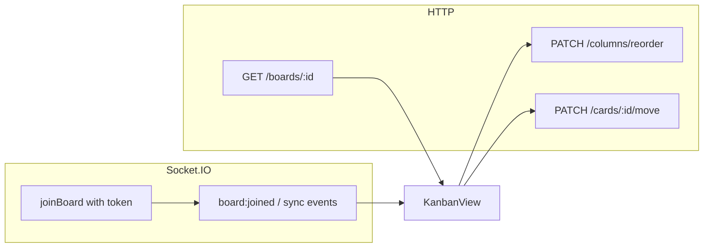

# Клієнтська схема (фронтенд) для Kanban API

Цей документ зводить до одного місця очікування бекенду щодо SPA: маршрути в браузері, REST-виклики, Socket.IO та обмеження для RBAC. Деталі HTTP і AsyncAPI див. у [documentation.md](../documentation.md); матриця ролей і прав — у [permissions.md](../permissions.md).

## Базова адреса API

- За замовчуванням сервер слухає порт **3500** (див. `src/main.ts`).
- Глобального префікса для REST немає: шляхи починаються з `/auth`, `/users`, `/teams`, `/boards`, `/columns`, `/cards`, `/health`.
- Swagger UI: **`/api`** (наприклад `http://localhost:3500/api`).
- WebSocket (Socket.IO): той самий origin, що й HTTP (наприклад `http://localhost:3500`).

## CORS

Браузерні запити з SPA на інший порт (наприклад `http://localhost:4200` → API на `http://localhost:3500`) потребують CORS. Політика задається на бекенді через змінну оточення **`CORS_ORIGINS`**: список дозволених origins через кому (без пробілів усередині URL або з пробілами — вони обрізаються).

- **Локальна розробка** (`NODE_ENV` не `production`): якщо `CORS_ORIGINS` не задано, використовуються типові dev-URL (`http://localhost:4200`, `http://localhost:5173`, `http://127.0.0.1:4200`, `http://127.0.0.1:5173`).
- **Production** (`NODE_ENV=production`): **`CORS_ORIGINS` обов’язковий**; інакше процес завершиться з помилкою при старті.
- Запити **без** заголовка `Origin` (curl, Postman, тести) залишаються дозволеними.
- **`credentials: true`** — для передачі **HttpOnly cookie** (refresh-токен) з браузера SPA потрібні `CORS_ORIGINS` з точним origin фронту та клієнтські запити з **`withCredentials: true`** (Angular `HttpClient` / `fetch` з `credentials: 'include'`).
- Та сама політика застосовується до **REST** і до **Socket.IO** (див. `src/config/cors-origins.ts`).

Приклад:

```bash
CORS_ORIGINS=http://localhost:4200,https://app.example.com
```

## Концепт фронтенду

- **Тип**: односторінковий додаток (SPA) з окремим HTTP-клієнтом і **одним** клієнтом Socket.IO на сесію (або на застосунок).
- **Авторизація (access + refresh)**:
  - **Access JWT** — короткоживучий, повертається в JSON (`accessToken`); зберігати в пам’яті (за бажання — `localStorage`); надсилати як `Authorization: Bearer <accessToken>`.
  - **Refresh JWT** — лише в **HttpOnly cookie** (ім’я за замовчуванням `refresh`, шлях cookie `/auth`); JavaScript не читає.
  - **`csrfToken`** — повертається в JSON після login/register/refresh; для `POST /auth/refresh` і `POST /auth/logout` потрібен той самий рядок у заголовку **`X-CSRF-Token`** або **`X-XSRF-TOKEN`** (alias для Angular).
  - **Другий cookie (double-submit)**: бекенд виставляє **читабельний** cookie з тим самим значенням, що й `csrfToken` (ім’я за замовчуванням **`XSRF-TOKEN`**, **`CSRF_COOKIE_NAME`**), не HttpOnly; **шлях за замовчуванням `/`** (**`CSRF_COOKIE_PATH`**), щоб cookie була видима в `document.cookie` на будь-якому маршруті SPA (`/boards` тощо). **Refresh**-cookie залишається окремо (типово **HttpOnly**, path **`/auth`**). Після **повного reload** access/`csrfToken` у пам’яті порожні; браузер надсилає cookie; фронт читає `document.cookie` (ім’я з env) і підставляє **`X-CSRF-Token`** / **`X-XSRF-TOKEN`** — **не** покладаючись на `sessionStorage` як на єдине джерело. У тій самій вкладці до reload додатково можна використати останній `csrfToken` з JSON у пам’яті, якщо cookie ще не прочитана. Сервер перевіряє збіг заголовка з CSRF-cookie (timing-safe); якщо CSRF-cookie немає (старий клієнт) — лишається перевірка HMAC відносно сесії refresh.
  - **Bootstrap після reload** (наприклад `APP_INITIALIZER`): `POST /auth/refresh` з **`withCredentials: true`** і CSRF-заголовком з **`document.cookie`** (основне джерело після F5); у тій самій вкладці без reload — за потреби з останнього JSON у пам’яті.
  - На **401** від API: викликати `POST /auth/refresh` з `credentials` і CSRF-заголовком, оновити `accessToken` і `csrfToken`, повторити запит.
  - Змінні оточення: `JWT_ACCESS_EXPIRES_IN` (напр. `15m`), `JWT_REFRESH_EXPIRES_IN` (напр. `7d`), `JWT_SECRET`, `JWT_REFRESH_SECRET`, опційно `CSRF_HMAC_SECRET`, `REFRESH_COOKIE_*`, `CSRF_COOKIE_NAME` — див. `src/auth/auth-cookie.config.ts`.

- **Дані дошки**: початкове завантаження канбану — `GET /boards/:id` (дошка з колонками та картками). Після змін з інших клієнтів оновлювати UI через події Socket.IO або робити повторний `GET /boards/:id` за потреби.
- **Реалтайм**: після відкриття екрану дошки підключитися до Socket.IO і надіслати **`joinBoard`** з `boardId` і **тим самим JWT** у тілі події (див. нижче); без токена в події кімната дошки недоступна.

## Клієнтський роутинг (браузер)

Рекомендована карта маршрутів (React Router / Vue Router тощо):

| Шлях | Призначення |
| --- | --- |
| `/login` | Вхід |
| `/register` | Реєстрація |
| `/teams` | Мої команди: список, створення команди |
| `/teams/:teamId` | Деталі команди; для admin — учасники (запрошення, ролі) |
| `/boards` | Список дошок поточного користувача (ізоляція по командах з боку API) |
| `/boards/:boardId` | Канбан: колонки, картки, drag-and-drop, коментарі |
| `/boards/:boardId/settings` (опційно) | Керування учасниками, якщо винесено з модалки |

**Захист маршрутів**

- **Гість** (немає валідного токена): доступ лише до `/login` та `/register`; спроба зайти на `/boards*` → редірект на `/login`.
- **Авторизований користувач**: доступ до `/teams`, `/boards` та `/boards/:boardId`; з `/login` після успішного входу → `/teams` (або `/boards` за політикою продукту).

## REST: ендпоінти та права

Усі таблиці нижче припускають заголовок `Authorization: Bearer <accessToken>`, крім блоку Auth.

### Auth (без Bearer)

| Метод | Шлях | Опис |
| --- | --- | --- |
| `POST` | `/auth/register` | Реєстрація; JSON: `user`, `accessToken`, `csrfToken`; **Set-Cookie** refresh (HttpOnly) + читабельний CSRF-cookie (`XSRF-TOKEN` за замовчуванням) |
| `POST` | `/auth/login` | Вхід; те саме + cookie |
| `POST` | `/auth/refresh` | Новий `accessToken` + `csrfToken`; оновлюються обидва cookie; потрібні **cookie** + **`X-CSRF-Token`** або **`X-XSRF-TOKEN`** (значення збігається з CSRF-cookie / `csrfToken`) |
| `POST` | `/auth/logout` | Відкликання refresh-сесії; **204**; очищаються refresh і CSRF cookie; **`X-CSRF-Token`** або **`X-XSRF-TOKEN`** |

Усі запити до `/auth/*` з браузера з іншого origin — з **`withCredentials: true`**.

### Users

| Метод | Шлях | Потрібний дозвіл | Опис |
| --- | --- | --- | --- |
| `GET` | `/users/me` | (лише JWT) | Поточний профіль |

### Teams

Команди групують дошки. Роль у команді: **`admin`** | **`user`**. Керування членами (`POST` / `PATCH` / `DELETE` members) — лише для **`admin`** команди.

| Метод | Шлях | Потрібний дозвіл | Опис |
| --- | --- | --- | --- |
| `GET` | `/teams` | (JWT) | Список команд поточного користувача (з полем ролі користувача в кожній команді) |
| `POST` | `/teams` | (JWT) | Створити команду (тіло зазвичай `{ "name": "..." }`; точна схема — Swagger) |
| `GET` | `/teams/:teamId` | (JWT) | Опційно: деталі команди з учасниками (якщо реалізовано на бекенді) |
| `POST` | `/teams/:teamId/members` | admin команди | Запросити учасника: `{ "userId": "<id>" }` |
| `PATCH` | `/teams/:teamId/members/:userId` | admin команди | Змінити роль: `{ "role": "admin" \| "user" }` |
| `DELETE` | `/teams/:teamId/members/:userId` | admin команди | Вилучити учасника |

**Примітка для UI:** адмін команди на бекенді має повні права на всі дошки цієї команди без окремого membership на дошці. Фронт може показувати повний набір дій, якщо `GET /teams` підтверджує роль `admin` для `teamId` активної дошки, або ховати дії після **403**.

### Boards

У відповідях дошки є **`teamId`**. **`POST /boards`** обов’язково містить **`title`** та **`teamId`**; створювати дошки може лише **admin відповідної команди** (перевірка на бекенді). **`GET /boards`** повертає лише дошки, доступні користувачу (ізоляція по командах).

| Метод | Шлях | Потрібний дозвіл | Опис |
| --- | --- | --- | --- |
| `POST` | `/boards` | `board:create` (і admin команди для `teamId`) | Створити дошку: `{ "title", "teamId", ... }` |
| `GET` | `/boards` | `board:list` | Список дошок |
| `GET` | `/boards/:id` | `board:read` | Дошка з колонками та картками |
| `PATCH` | `/boards/:id` | `board:update` | Оновити дошку (наприклад назву) |
| `DELETE` | `/boards/:id` | `board:delete` | М’яке видалення дошки |
| `POST` | `/boards/:boardId/members` | `member:invite` | Запросити учасника дошки: `{ "userId" }`; дозволено лише для користувачів **тієї самої команди**; дефолтна роль на дошці після інвайту — **viewer** |
| `PATCH` | `/boards/:boardId/members/:memberUserId/role` | `member:update_role` | Змінити роль учасника |
| `DELETE` | `/boards/:boardId/members/:memberUserId` | `member:remove` | Вилучити учасника |

### Columns

| Метод | Шлях | Потрібний дозвіл | Опис |
| --- | --- | --- | --- |
| `POST` | `/columns` | `column:create` | Створити колонку (у тілі є `boardId`) |
| `PATCH` | `/columns/reorder` | `column:reorder` | Змінити порядок колонок |
| `PATCH` | `/columns/:id` | `column:update` | Оновити колонку |
| `DELETE` | `/columns/:id` | `column:delete` | Видалити колонку (м’яко, з картками) |

### Cards

| Метод | Шлях | Потрібний дозвіл | Опис |
| --- | --- | --- | --- |
| `POST` | `/cards` | `card:create` | Створити картку |
| `PATCH` | `/cards/:id` | `card:update` | Оновити поля картки |
| `PATCH` | `/cards/:id/move` | `card:move` | Перенести картку / порядок |
| `DELETE` | `/cards/:id` | `card:delete` | М’яке видалення картки |
| `POST` | `/cards/:id/comments` | `comment:create` | Додати коментар |
| `DELETE` | `/cards/:id/comments/:commentId` | Перевірка в сервісі | Видалити коментар (свій або з правом `comment:delete:any`) |

### Health

| Метод | Шлях | Опис |
| --- | --- | --- |
| `GET` | `/health` | Перевірка доступності сервісу (`{ "status": "ok" }`) |

Точні тіла запитів і DTO — у Swagger на `/api`.

## WebSocket (Socket.IO)

- Підключення до того ж базового URL, що й REST.
- **Клієнт → сервер**

  - Подія **`joinBoard`**, тіло: `{ "boardId": "<id>", "token": "<accessToken>" }`.
  - Обов’язково передати **JWT у полі `token`**; інакше сервер надішле помилку (див. нижче).
  - Для `joinBoard` на бекенді перевіряється право **`board:read`** на цю дошку.

- **Сервер → клієнт (підтвердження / помилки)**

  - `board:joined` — `{ boardId }` після успішного входу в кімнату `board:<boardId>`.
  - `board:join_error` — `{ message: 'Unauthorized' | 'Forbidden' }` при відсутності токена, невалідному JWT або відсутності права `board:read`.

- **Сервер → клієнт (оновлення в кімнаті дошки)**

  - `board:updated` — payload: об’єкт дошки (`BoardResponseDto`).
  - `board:deleted` — payload: об’єкт дошки.
  - `columns:updated` — `{ boardId, columns }`.
  - `card:created` — картка (`CardResponseDto`).
  - `card:updated` — картка.
  - `card:moved` — повний знімок дошки з колонками та картками (`BoardDetailsResponseDto`).
  - `comment:added` — картка після додавання коментаря.

Орієнтуйтесь на ці імена подій; якщо в [asyncapi.yaml](../asyncapi.yaml) зустрінуться відмінності, пріоритет має код у `src/events/events.gateway.ts`.

## RBAC на фронтенді

- Повна матриця **роль → дозвіл** описана в [permissions.md](../permissions.md).
- Відповідь **`GET /boards/:id` не містить ролі поточного користувача** на дошці. Можливі підходи для UI:
  - Порівняти `board.ownerId` з `id` з **`GET /users/me`**, щоб визначити власника.
  - Для учасників без окремого поля в API — ховати «небезпечні» дії за узгодженою матрицею лише якщо з’явиться endpoint (наприклад «моя роль на дошці») або обробляти **403** після спроби дії.
- Детальний перелік **endpoint → дозвіл** — у [permissions.md](../permissions.md) (розділ «Endpoint -> Required Permission»).

## Діаграма потоку на екрані дошки



Після завантаження даних через HTTP клієнт підписується на події в кімнаті дошки й оновлює локальний стан або перезавантажує деталі дошки залежно від обраної стратегії.
