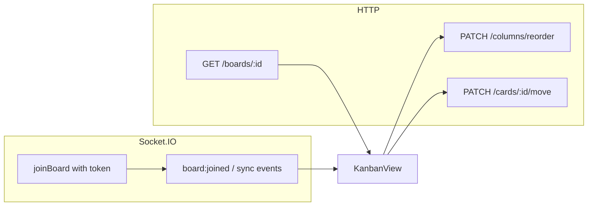

# Клієнтська схема (фронтенд) для Kanban API

Цей документ зводить до одного місця очікування бекенду щодо SPA: маршрути в браузері, REST-виклики, Socket.IO та обмеження для RBAC. Деталі HTTP і AsyncAPI див. у [documentation.md](../documentation.md); матриця ролей і прав — у [permissions.md](../permissions.md).

## Базова адреса API

- За замовчуванням сервер слухає порт **3500** (див. `src/main.ts`).
- Глобального префікса для REST немає: шляхи починаються з `/auth`, `/users`, `/boards`, `/columns`, `/cards`, `/health`.
- Swagger UI: **`/api`** (наприклад `http://localhost:3500/api`).
- WebSocket (Socket.IO): той самий origin, що й HTTP (наприклад `http://localhost:3500`).

## CORS

Браузерні запити з SPA на інший порт (наприклад `http://localhost:4200` → API на `http://localhost:3500`) потребують CORS. Політика задається на бекенді через змінну оточення **`CORS_ORIGINS`**: список дозволених origins через кому (без пробілів усередині URL або з пробілами — вони обрізаються).

- **Локальна розробка** (`NODE_ENV` не `production`): якщо `CORS_ORIGINS` не задано, використовуються типові dev-URL (`http://localhost:4200`, `http://localhost:5173`, `http://127.0.0.1:4200`, `http://127.0.0.1:5173`).
- **Production** (`NODE_ENV=production`): **`CORS_ORIGINS` обов’язковий**; інакше процес завершиться з помилкою при старті.
- Запити **без** заголовка `Origin` (curl, Postman, тести) залишаються дозволеними.
- Та сама політика застосовується до **REST** і до **Socket.IO** (див. `src/config/cors-origins.ts`).

Приклад:

```bash
CORS_ORIGINS=http://localhost:4200,https://app.example.com
```

Після зміни **`CORS_ORIGINS`** або **`NODE_ENV`** перезапустіть API — список дозволених origins зчитується при старті (у консолі: `CORS allowed origins: ...`). У бекенді зразок змінних: **`.env.sample`** (рядок `CORS_ORIGINS` можна розкоментувати). Готовий фрагмент для вставки: [`cors-env-append-for-backend.txt`](cors-env-append-for-backend.txt).

### Локальна розробка з Angular (`ng serve`)

У каталозі frontend налаштовано **`proxy.conf.json`**: запити на `/auth`, `/users`, `/boards`, `/columns`, `/cards`, `/health`, `/api` та WebSocket `/socket.io` проксуються на `http://localhost:3500`. У **`environment.ts`** для dev за замовчуванням `apiUrl: ''` (відносні URL), тому браузер звертається лише до origin dev-сервера (наприклад `http://localhost:4200`) і CORS між 4200 і 3500 не потрібен. Для прямих запитів на API задайте `apiUrl: 'http://localhost:3500'` і переконайтеся, що ваш origin у **`CORS_ORIGINS`**.

## Концепт фронтенду

- **Тип**: односторінковий додаток (SPA) з окремим HTTP-клієнтом і **одним** клієнтом Socket.IO на сесію (або на застосунок).
- **Авторизація**: після `POST /auth/login` або `POST /auth/register` зберігати **`accessToken`** (наприклад у пам’яті + `localStorage` за потреби) і передавати в заголовку `Authorization: Bearer <accessToken>` для всіх захищених REST-запитів.
- **Дані дошки**: початкове завантаження канбану — `GET /boards/:id` (дошка з колонками та картками). Після змін з інших клієнтів оновлювати UI через події Socket.IO або робити повторний `GET /boards/:id` за потреби.
- **Реалтайм**: після відкриття екрану дошки підключитися до Socket.IO і надіслати **`joinBoard`** з `boardId` і **тим самим JWT** у тілі події (див. нижче); без токена в події кімната дошки недоступна.

## Клієнтський роутинг (браузер)

Рекомендована карта маршрутів (React Router / Vue Router тощо):

| Шлях | Призначення |
| --- | --- |
| `/login` | Вхід |
| `/register` | Реєстрація |
| `/boards` | Список дошок поточного користувача |
| `/boards/:boardId` | Канбан: колонки, картки, drag-and-drop, коментарі |
| `/boards/:boardId/settings` (опційно) | Керування учасниками, якщо винесено з модалки |

**Захист маршрутів**

- **Гість** (немає валідного токена): доступ лише до `/login` та `/register`; спроба зайти на `/boards*` → редірект на `/login`.
- **Авторизований користувач**: доступ до `/boards` та `/boards/:boardId`; з `/login` після успішного входу → `/boards`.

## REST: ендпоінти та права

Усі таблиці нижче припускають заголовок `Authorization: Bearer <accessToken>`, крім блоку Auth.

### Auth (без Bearer)

| Метод | Шлях | Опис |
| --- | --- | --- |
| `POST` | `/auth/register` | Реєстрація; у відповіді `user` та `accessToken` |
| `POST` | `/auth/login` | Вхід; `accessToken` |

### Users

| Метод | Шлях | Потрібний дозвіл | Опис |
| --- | --- | --- | --- |
| `GET` | `/users/me` | (лише JWT) | Поточний профіль |

### Boards

| Метод | Шлях | Потрібний дозвіл | Опис |
| --- | --- | --- | --- |
| `POST` | `/boards` | `board:create` | Створити дошку |
| `GET` | `/boards` | `board:list` | Список дошок |
| `GET` | `/boards/:id` | `board:read` | Дошка з колонками та картками |
| `PATCH` | `/boards/:id` | `board:update` | Оновити дошку (наприклад назву) |
| `DELETE` | `/boards/:id` | `board:delete` | М’яке видалення дошки |
| `POST` | `/boards/:boardId/members` | `member:invite` | Запросити учасника |
| `PATCH` | `/boards/:boardId/members/:memberUserId/role` | `member:update_role` | Змінити роль учасника |
| `DELETE` | `/boards/:boardId/members/:memberUserId` | `member:remove` | Вилучити учасника |

### Columns

| Метод | Шлях | Потрібний дозвіл | Опис |
| --- | --- | --- | --- |
| `POST` | `/columns` | `column:create` | Створити колонку (у тілі є `boardId`) |
| `PATCH` | `/columns/reorder` | `column:reorder` | Змінити порядок колонок |
| `PATCH` | `/columns/:id` | `column:update` | Оновити колонку |
| `DELETE` | `/columns/:id` | `column:delete` | Видалити колонку (м’яко, з картками) |

### Cards

| Метод | Шлях | Потрібний дозвіл | Опис |
| --- | --- | --- | --- |
| `POST` | `/cards` | `card:create` | Створити картку |
| `PATCH` | `/cards/:id` | `card:update` | Оновити поля картки |
| `PATCH` | `/cards/:id/move` | `card:move` | Перенести картку / порядок |
| `DELETE` | `/cards/:id` | `card:delete` | М’яке видалення картки |
| `POST` | `/cards/:id/comments` | `comment:create` | Додати коментар |
| `DELETE` | `/cards/:id/comments/:commentId` | Перевірка в сервісі | Видалити коментар (свій або з правом `comment:delete:any`) |

### Health

| Метод | Шлях | Опис |
| --- | --- | --- |
| `GET` | `/health` | Перевірка доступності сервісу (`{ "status": "ok" }`) |

Точні тіла запитів і DTO — у Swagger на `/api`.

## WebSocket (Socket.IO)

- Підключення до того ж базового URL, що й REST.
- **Клієнт → сервер**

  - Подія **`joinBoard`**, тіло: `{ "boardId": "<id>", "token": "<accessToken>" }`.
  - Обов’язково передати **JWT у полі `token`**; інакше сервер надішле помилку (див. нижче).
  - Для `joinBoard` на бекенді перевіряється право **`board:read`** на цю дошку.

- **Сервер → клієнт (підтвердження / помилки)**

  - `board:joined` — `{ boardId }` після успішного входу в кімнату `board:<boardId>`.
  - `board:join_error` — `{ message: 'Unauthorized' | 'Forbidden' }` при відсутності токена, невалідному JWT або відсутності права `board:read`.

- **Сервер → клієнт (оновлення в кімнаті дошки)**

  - `board:updated` — payload: об’єкт дошки (`BoardResponseDto`).
  - `board:deleted` — payload: об’єкт дошки.
  - `columns:updated` — `{ boardId, columns }`.
  - `card:created` — картка (`CardResponseDto`).
  - `card:updated` — картка.
  - `card:moved` — повний знімок дошки з колонками та картками (`BoardDetailsResponseDto`).
  - `comment:added` — картка після додавання коментаря.

Орієнтуйтесь на ці імена подій; якщо в [asyncapi.yaml](../asyncapi.yaml) зустрінуться відмінності, пріоритет має код у `src/events/events.gateway.ts`.

## RBAC на фронтенді

- Повна матриця **роль → дозвіл** описана в [permissions.md](../permissions.md).
- Відповідь **`GET /boards/:id` не містить ролі поточного користувача** на дошці. Можливі підходи для UI:
  - Порівняти `board.ownerId` з `id` з **`GET /users/me`**, щоб визначити власника.
  - Для учасників без окремого поля в API — ховати «небезпечні» дії за узгодженою матрицею лише якщо з’явиться endpoint (наприклад «моя роль на дошці») або обробляти **403** після спроби дії.
- Детальний перелік **endpoint → дозвіл** — у [permissions.md](../permissions.md) (розділ «Endpoint -> Required Permission»).

## Діаграма потоку на екрані дошки



Після завантаження даних через HTTP клієнт підписується на події в кімнаті дошки й оновлює локальний стан або перезавантажує деталі дошки залежно від обраної стратегії.
